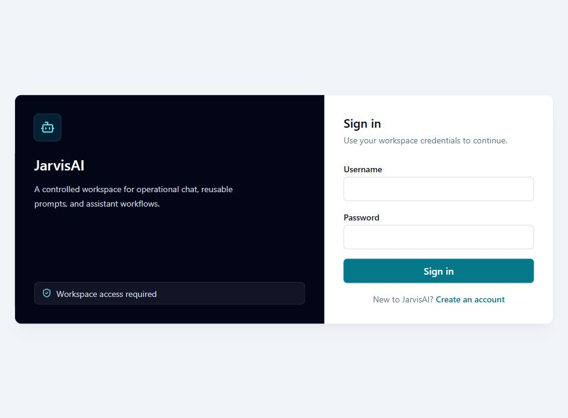
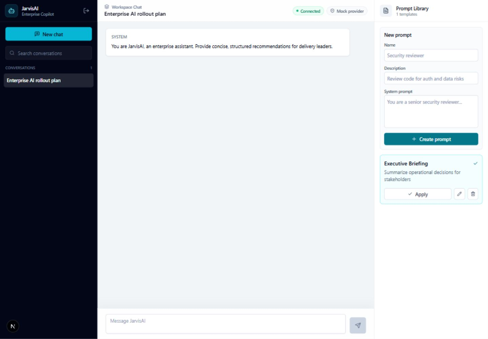
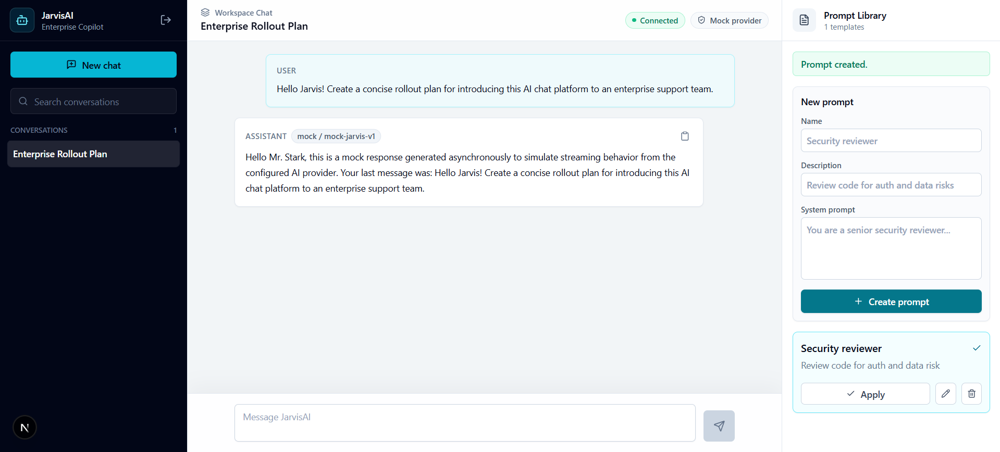
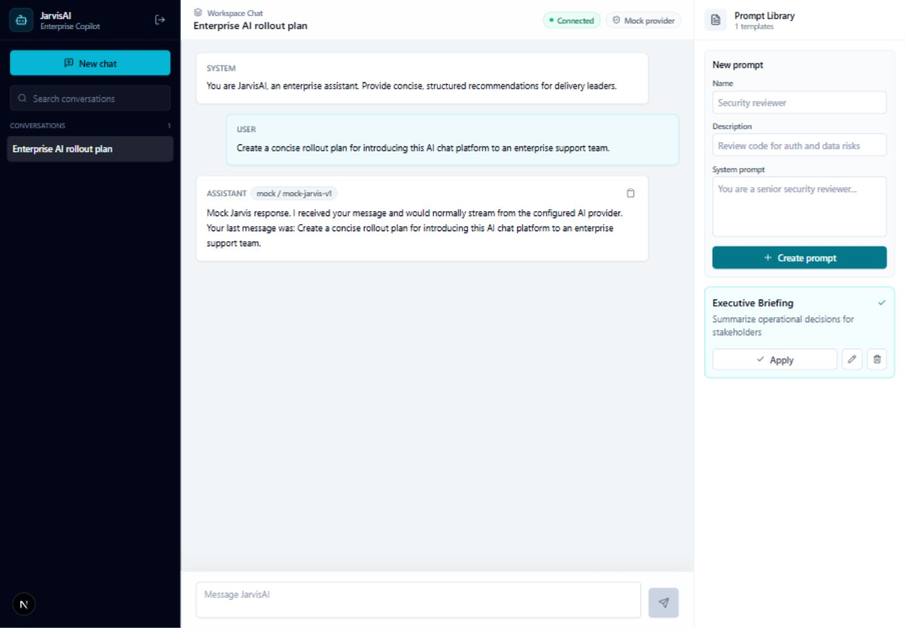
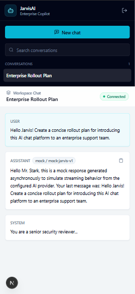
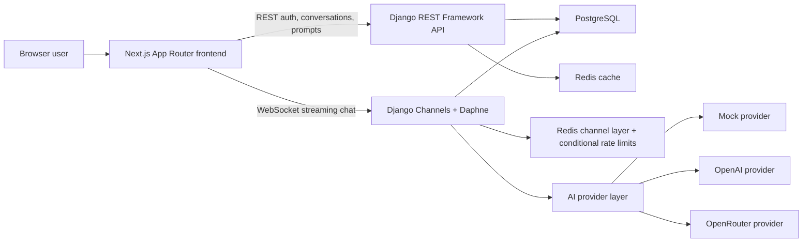

# JarvisAI

JarvisAI is an enterprise-style AI chat platform built with Next.js, Django REST Framework, Django Channels, Redis, PostgreSQL, and Docker.

This repository is designed as a flagship full-stack project: it demonstrates authenticated AI chat, persisted conversation history, WebSocket streaming, reusable prompt templates, Redis-backed operational behavior, and provider abstraction for mock, OpenAI-backed, or OpenRouter-backed responses.

The default local mode uses the mock provider, so the full product can be reviewed without paid AI credentials. OpenRouter can also be selected with the configured free model IDs.

## Screenshots











## Product Highlights

- Secure workspace access with JWT login, refresh, logout, and blacklist support
- Enterprise chat workspace with conversation history, rename, archive, search, markdown rendering, and copy actions
- WebSocket streaming through Django Channels with connection status, failed-state handling, provider metadata, and conditional rate limiting
- Prompt template library with create, edit, delete, and apply-to-conversation workflows
- Redis-backed caching for conversation and prompt list performance
- Mock AI provider for demos plus OpenAI and OpenRouter provider configuration for real completions
- Fast local test suite that runs without Docker, PostgreSQL, Redis, or paid AI keys

## Current Status

Implemented:

- Next.js App Router frontend with TypeScript and Tailwind CSS
- Django REST Framework API backend
- Django Channels WebSocket backend running through Daphne
- Docker Compose foundation for frontend, backend, PostgreSQL, and Redis
- JWT registration, login, refresh, logout, refresh rotation, and token blacklist support
- Protected frontend auth flow with access-token refresh on `401`
- Conversation list/detail APIs with lightweight list responses
- Message history loading and markdown rendering
- Conversation rename, soft archive/delete, search/filter, and auto-title behavior
- Streaming chat over WebSockets with connection lifecycle feedback
- Streaming, completed, failed, rate-limited, and provider-error UI states
- Assistant message copy action and retry draft preparation
- Prompt template CRUD UI
- Apply prompt templates to conversations as persisted system messages
- Redis-backed conversation and prompt ID-list caching
- Per-user WebSocket chat request throttling for non-free providers
- Mock AI provider for local demos without paid keys
- OpenAI provider foundation with configurable model, temperature, max tokens, and timeout
- OpenRouter provider with configured free model IDs including `liquid/lfm-2.5-1.2b-instruct:free`
- Assistant message provider/model metadata persistence
- Sanitized AI provider errors
- Focused backend API and provider tests
- Local test settings that run without Docker, PostgreSQL, Redis, or paid AI keys
- Public database/cache health endpoint for deployment smoke checks
- Environment-driven production security settings and console logging
- GitHub Actions CI for backend checks/tests and frontend production builds
- Project governance docs in `AGENTS.md`, `PLANS.md`, and `.codex/`

Deployment guides:

- [Architecture and AWS backend notes](docs/ARCHITECTURE_DEPLOYMENT.md)
- [Vercel frontend deployment](docs/VERCEL_DEPLOYMENT.md)
- [Production checklist](docs/PRODUCTION_CHECKLIST.md)

## Architecture



More detail is available in [docs/ARCHITECTURE_DEPLOYMENT.md](docs/ARCHITECTURE_DEPLOYMENT.md).

## Tech Stack

Frontend:

- Next.js App Router
- React
- TypeScript
- Tailwind CSS
- React Markdown
- Lucide icons

Backend:

- Django
- Django REST Framework
- Django Channels
- Daphne
- SimpleJWT

Infrastructure:

- Docker Compose
- PostgreSQL
- Redis

AI:

- Mock provider for local development and demos
- OpenAI provider for real completions
- OpenRouter provider for the configured free models
- Configurable provider/model settings through environment variables

## Local Setup

Copy the environment file:

```bash
cp .env.example .env
```

Start the stack:

```bash
docker compose up --build -d
```

Run migrations:

```bash
docker compose exec backend python manage.py migrate
```

Open:

- Frontend: http://localhost:3000
- Backend API: http://localhost:8000/api

By default `AI_PROVIDER=mock`, so the app works locally without provider API keys.

## Demo Workflow

After the stack is running:

1. Register a local account or sign in.
2. Create a conversation from the sidebar.
3. Create a prompt template in the Prompt Library.
4. Apply the prompt to the active conversation.
5. Send a chat message and watch the assistant stream a mock response.

This flow exercises authentication, REST APIs, WebSocket streaming, prompt management, Redis-backed behavior, and persisted message history.

## Environment Configuration

Core service variables:

```text
POSTGRES_DB=jarvis
POSTGRES_USER=jarvis
POSTGRES_PASSWORD=jarvis
POSTGRES_HOST=db
POSTGRES_PORT=5432
REDIS_URL=redis://redis:6379/0
```

Django/frontend variables:

```text
DJANGO_SECRET_KEY=change-me
DJANGO_DEBUG=true
DJANGO_ALLOWED_HOSTS=localhost,127.0.0.1,backend
DJANGO_CORS_ALLOWED_ORIGINS=http://localhost:3000
NEXT_PUBLIC_API_BASE_URL=http://localhost:8000/api
NEXT_PUBLIC_WS_BASE_URL=ws://localhost:8000/ws
```

AI provider variables:

```text
AI_PROVIDER=mock
MOCK_AI_MODEL=mock-jarvis-v1
OPENAI_API_KEY=
OPENAI_MODEL=gpt-4o-mini
OPENAI_TEMPERATURE=0.7
OPENAI_MAX_TOKENS=0
OPENAI_TIMEOUT_SECONDS=30
OPENROUTER_API_KEY=
OPENROUTER_BASE_URL=https://openrouter.ai/api/v1
OPENROUTER_MODEL=liquid/lfm-2.5-1.2b-instruct:free
OPENROUTER_TEMPERATURE=0.7
OPENROUTER_MAX_TOKENS=0
OPENROUTER_TIMEOUT_SECONDS=30
OPENROUTER_HTTP_REFERER=http://localhost:3000
OPENROUTER_APP_TITLE=JarvisAI
```

Rate-limit variables:

```text
CHAT_RATE_LIMIT_COUNT=20
CHAT_RATE_LIMIT_WINDOW_SECONDS=60
```

Use `AI_PROVIDER=openai` only when `OPENAI_API_KEY` is configured in your local or deployment environment. Use `AI_PROVIDER=openrouter` only when `OPENROUTER_API_KEY` is configured. The OpenRouter provider accepts these configured free model IDs:

```text
liquid/lfm-2.5-1.2b-instruct:free
qwen/qwen3-next-80b-a3b-instruct:free
openai/gpt-oss-120b:free
```

OpenRouter uses the OpenAI-compatible `POST /api/v1/chat/completions` API with streaming enabled and optional app attribution headers. OpenRouter free models may still return provider-side `429` rate limits even though JarvisAI does not apply its own chat throttle to the OpenRouter provider.

## API Overview

Auth:

```text
POST /api/auth/register/
POST /api/auth/login/
POST /api/auth/logout/
POST /api/auth/token/refresh/
GET  /api/auth/me/
```

Conversations:

```text
GET    /api/conversations/
POST   /api/conversations/
GET    /api/conversations/:id/
PATCH  /api/conversations/:id/
DELETE /api/conversations/:id/
GET    /api/conversations/:id/messages/
POST   /api/conversations/:id/apply_prompt/
```

Prompts:

```text
GET    /api/prompts/
POST   /api/prompts/
GET    /api/prompts/:id/
PATCH  /api/prompts/:id/
DELETE /api/prompts/:id/
```

WebSocket:

```text
ws://localhost:8000/ws/chat/:conversation_id/?token=<access_token>
```

Health:

```text
GET /api/health/
```

Client-to-server chat event:

```json
{
  "type": "user.message",
  "content": "Explain this architecture."
}
```

Server-to-client event types:

```text
connection.ready
assistant.started
assistant.delta
assistant.completed
assistant.failed
rate_limited
error
```

## Redis Usage

Redis is used for:

- Django Channels layer
- Django cache backend
- Per-user conversation ID-list caching
- Per-user prompt ID-list caching
- Per-user WebSocket chat request throttling for mock and OpenAI providers

Message contents are persisted in PostgreSQL and are not cached as a Redis optimization.

## Development Workflow

Source checks:

```bash
cd backend
python manage.py check
python manage.py makemigrations --check --dry-run
python manage.py test --settings=config.test_settings

cd ../frontend
npm run build
```

The test settings module swaps PostgreSQL, Redis cache, and Redis-backed Channels for in-memory local equivalents. This keeps the backend test suite fast and runnable without Docker or paid AI provider credentials.

Portfolio assets:

```text
docs/assets/screenshots/
docs/ARCHITECTURE_DEPLOYMENT.md
```

Useful service checks:

```bash
docker compose ps
docker compose logs backend
docker compose logs frontend
docker compose logs redis
```

WebSocket troubleshooting:

- If chat connects and then disconnects after about 5 seconds with server close code `1011`, check backend logs for `Timeout reading from redis`. JarvisAI pins `redis<8.0` because `channels-redis` 4.3 can hit idle blocking-read timeouts with newer Redis Python clients.

## Project Governance

- `AGENTS.md` defines AI-agent operating rules for this repository.
- `PLANS.md` tracks completed and upcoming build phases.
- `.codex/` contains project-local Codex guidance.
- The user owns Docker Compose, git, and GitHub write operations.
- Codex works inside `JarvisAI` and asks before accessing anything outside the project folder.

## Security Notes

- `.env` is ignored by git.
- `.env.example` documents required variables and uses development-safe placeholders.
- Never commit API keys, tokens, database dumps, virtual environments, `node_modules`, or build output.
- Keep `AI_PROVIDER=mock` for demos and local development without provider keys, or use `AI_PROVIDER=openrouter` with one of the configured free OpenRouter models.
