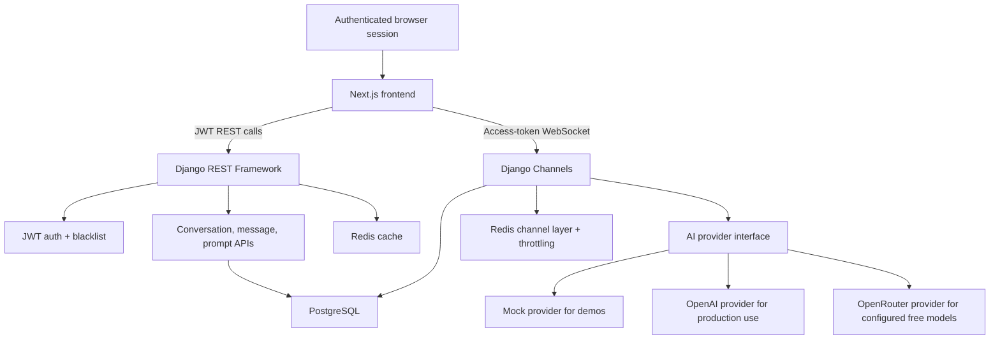

# JarvisAI Architecture And Deployment Notes

JarvisAI is structured as a portfolio-grade full-stack AI application. The frontend owns the authenticated workspace experience, the backend owns persistence and provider orchestration, and Redis supports realtime and cached operational paths.

## System Architecture



## Runtime Responsibilities

- Next.js renders the App Router frontend, stores JWT tokens client-side, calls REST APIs, and opens the chat WebSocket.
- Django REST Framework handles account, conversation, message, and prompt APIs.
- Django Channels streams assistant responses over WebSockets and persists user/assistant messages.
- PostgreSQL stores users, refresh-token blacklist data, conversations, messages, and prompt templates.
- Redis backs the Channels layer, cached ID lists, and per-user chat throttling for non-free providers.
- The AI provider layer keeps local demos free through `AI_PROVIDER=mock`, enables direct OpenAI completions with `AI_PROVIDER=openai`, and supports OpenRouter free models with `AI_PROVIDER=openrouter`.

## Deployment Shape

Recommended split:

- Frontend: Vercel project built from `frontend`.
- Backend: AWS App Runner container deployment from `backend`, running Daphne/ASGI.
- Database: Amazon RDS for PostgreSQL.
- Redis: Amazon ElastiCache for Redis.

The backend should be deployed before switching the frontend to production API URLs. The frontend needs public `NEXT_PUBLIC_API_BASE_URL` and `NEXT_PUBLIC_WS_BASE_URL` values that point to the deployed backend.

## Vercel Frontend Deployment

Create a Vercel project from this repository with:

```text
Root Directory: frontend
Framework Preset: Next.js
Build Command: npm run build
Install Command: npm install
```

Configure:

```text
NEXT_PUBLIC_API_BASE_URL=https://<backend-host>/api
NEXT_PUBLIC_WS_BASE_URL=wss://<backend-host>/ws
```

Redeploy after changing either public URL. Next.js embeds `NEXT_PUBLIC_*` values into the browser bundle at build time.

## AWS Backend Deployment

Recommended first production path:

1. Build the backend image from `backend/Dockerfile`.
2. Push the image to Amazon ECR.
3. Create an AWS App Runner service from the ECR image.
4. Configure the container port as `8000`.
5. Create RDS PostgreSQL and ElastiCache Redis instances reachable from the backend service.
6. Add backend environment variables from the checklist below.
7. Run Django migrations as a one-off task using the same backend image.
8. Verify `GET https://<backend-host>/api/health/`.
9. Set the Vercel frontend URLs and redeploy the frontend.

JarvisAI requires a backend host that supports WebSocket upgrades. Validate this before selecting an alternative AWS runtime.

## Production Environment Checklist

Backend:

```text
DJANGO_SECRET_KEY=<strong-secret>
DJANGO_DEBUG=false
DJANGO_ALLOWED_HOSTS=<backend-host>
DJANGO_CORS_ALLOWED_ORIGINS=<frontend-origin>
DJANGO_CSRF_TRUSTED_ORIGINS=<frontend-origin>
DJANGO_SECURE_SSL_REDIRECT=true
DJANGO_SESSION_COOKIE_SECURE=true
DJANGO_CSRF_COOKIE_SECURE=true
DJANGO_SECURE_HSTS_SECONDS=31536000
DJANGO_SECURE_HSTS_INCLUDE_SUBDOMAINS=true
DJANGO_SECURE_HSTS_PRELOAD=true
DJANGO_LOG_LEVEL=INFO
POSTGRES_DB=<database-name>
POSTGRES_USER=<database-user>
POSTGRES_PASSWORD=<database-password>
POSTGRES_HOST=<database-host>
POSTGRES_PORT=5432
REDIS_URL=<redis-url>
AI_PROVIDER=mock|openai|openrouter
OPENAI_API_KEY=<only-when-openai-is-selected>
OPENAI_MODEL=gpt-4o-mini
OPENAI_TEMPERATURE=0.7
OPENAI_MAX_TOKENS=0
OPENAI_TIMEOUT_SECONDS=30
OPENROUTER_API_KEY=<only-when-openrouter-is-selected>
OPENROUTER_BASE_URL=https://openrouter.ai/api/v1
OPENROUTER_MODEL=liquid/lfm-2.5-1.2b-instruct:free
OPENROUTER_TEMPERATURE=0.7
OPENROUTER_MAX_TOKENS=0
OPENROUTER_TIMEOUT_SECONDS=30
OPENROUTER_HTTP_REFERER=https://<frontend-host>
OPENROUTER_APP_TITLE=JarvisAI
CHAT_RATE_LIMIT_COUNT=20
CHAT_RATE_LIMIT_WINDOW_SECONDS=60
```

Supported OpenRouter free models include `liquid/lfm-2.5-1.2b-instruct:free`, `qwen/qwen3-next-80b-a3b-instruct:free`, and `openai/gpt-oss-120b:free`. Because the configured OpenRouter models are free, JarvisAI does not apply its own WebSocket chat rate limit when `AI_PROVIDER=openrouter`. OpenRouter can still apply provider-side free-model quotas.

Frontend:

```text
NEXT_PUBLIC_API_BASE_URL=https://<backend-host>/api
NEXT_PUBLIC_WS_BASE_URL=wss://<backend-host>/ws
```

## Validation

Local non-Docker checks:

```powershell
cd backend
.\.venv\Scripts\python manage.py test --settings=config.test_settings
.\.venv\Scripts\python manage.py check --settings=config.test_settings

cd ..\frontend
npm run build
```

User-owned Docker checks:

```powershell
docker compose up --build -d
docker compose exec backend python manage.py migrate
```

Production smoke checks:

```text
GET  https://<backend-host>/api/health/
POST https://<backend-host>/api/auth/register/
POST https://<backend-host>/api/auth/login/
WS   wss://<backend-host>/ws/chat/<conversation-id>/?token=<access-token>
```

## Release Checklist

- Set `DJANGO_DEBUG=false`.
- Replace the development secret with a strong `DJANGO_SECRET_KEY`.
- Restrict allowed hosts, CORS origins, and CSRF trusted origins to production hosts.
- Enable HTTPS redirect, secure cookies, and HSTS only after HTTPS is working.
- Run migrations using the production database configuration.
- Verify `/api/health/` returns database and cache status as `ok`.
- Confirm WebSocket streaming through the deployed frontend.
- Start with `AI_PROVIDER=mock`; switch to `openai` or `openrouter` only after secret storage is configured.
- Keep `OPENAI_API_KEY` and `OPENROUTER_API_KEY` in the backend secret store only.
- Review console logs for errors after the first production session.

## Observability Notes

- The backend emits timestamped console logs controlled by `DJANGO_LOG_LEVEL`.
- App Runner or the selected container runtime should ship stdout/stderr to CloudWatch.
- `/api/health/` verifies database and Redis cache connectivity for smoke checks and uptime monitoring.
- Do not expose secrets, tokens, prompt contents, or full message bodies in logs.

## Portfolio Review Path

For reviewers, the fastest evaluation path is:

1. Read the README feature list and screenshots.
2. Inspect the architecture diagram above.
3. Run the local Docker stack with the mock provider.
4. Register, create a prompt, apply it to a conversation, and send a chat message.
5. Review backend tests for auth, prompt ownership, conversations, and provider behavior.
