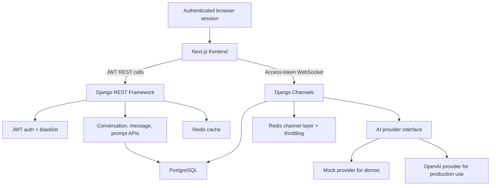

# JarvisAI Architecture And Deployment Notes

JarvisAI is structured as a portfolio-grade full-stack AI application. The frontend owns the authenticated workspace experience, the backend owns persistence and provider orchestration, and Redis supports realtime and cached operational paths.

## System Architecture



## Runtime Responsibilities

- Next.js renders the App Router frontend, stores JWT tokens client-side, calls REST APIs, and opens the chat WebSocket.
- Django REST Framework handles account, conversation, message, and prompt APIs.
- Django Channels streams assistant responses over WebSockets and persists user/assistant messages.
- PostgreSQL stores users, refresh-token blacklist data, conversations, messages, and prompt templates.
- Redis backs the Channels layer, cached ID lists, and per-user chat throttling.
- The AI provider layer keeps local demos free through `AI_PROVIDER=mock` and enables real completions with `AI_PROVIDER=openai`.

## Deployment Shape

Recommended split:

- Frontend: Vercel project built from `frontend`.
- Backend: AWS container deployment from `backend`, running Daphne/ASGI.
- Database: managed PostgreSQL.
- Redis: managed Redis compatible with Django cache and Channels.

The backend should be deployed before switching the frontend to production API URLs. The frontend needs public `NEXT_PUBLIC_API_BASE_URL` and `NEXT_PUBLIC_WS_BASE_URL` values that point to the deployed backend.

## Production Environment Checklist

Backend:

```text
DJANGO_SECRET_KEY=<strong-secret>
DJANGO_DEBUG=false
DJANGO_ALLOWED_HOSTS=<backend-host>
DJANGO_CORS_ALLOWED_ORIGINS=<frontend-origin>
POSTGRES_DB=<database-name>
POSTGRES_USER=<database-user>
POSTGRES_PASSWORD=<database-password>
POSTGRES_HOST=<database-host>
POSTGRES_PORT=5432
REDIS_URL=<redis-url>
AI_PROVIDER=mock|openai
OPENAI_API_KEY=<only-when-openai-is-selected>
OPENAI_MODEL=gpt-4o-mini
OPENAI_TEMPERATURE=0.7
OPENAI_MAX_TOKENS=0
OPENAI_TIMEOUT_SECONDS=30
CHAT_RATE_LIMIT_COUNT=20
CHAT_RATE_LIMIT_WINDOW_SECONDS=60
```

Frontend:

```text
NEXT_PUBLIC_API_BASE_URL=https://<backend-host>/api
NEXT_PUBLIC_WS_BASE_URL=wss://<backend-host>/ws
```

## Validation

Local non-Docker checks:

```powershell
cd backend
.\.venv\Scripts\python manage.py test --settings=config.test_settings
.\.venv\Scripts\python manage.py check --settings=config.test_settings

cd ..\frontend
npm run build
```

User-owned Docker checks:

```powershell
docker compose up --build -d
docker compose exec backend python manage.py migrate
```

## Portfolio Review Path

For reviewers, the fastest evaluation path is:

1. Read the README feature list and screenshots.
2. Inspect the architecture diagram above.
3. Run the local Docker stack with the mock provider.
4. Register, create a prompt, apply it to a conversation, and send a chat message.
5. Review backend tests for auth, prompt ownership, conversations, and provider behavior.
